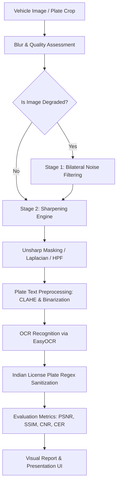

# Part 2: Number Plate Image Enhancement, Sharpening & Character Recognition

## Academic & Technical Documentation

---

## 1. Project Overview & System Architecture

This project implements an end-to-end computer vision pipeline designed to restore degraded vehicle license plate images and improve Optical Character Recognition (OCR) accuracy.

### High-Level Architecture Flowchart



---

## 2. Theoretical Background & Mathematical Formulations

### 2.1 Blur Detection: Variance of the Laplacian
The Laplacian operator $\nabla^2 I$ is an isotropic measure of the 2nd spatial derivative:
$$\nabla^2 I(x, y) = \frac{\partial^2 I}{\partial x^2} + \frac{\partial^2 I}{\partial y^2}$$

In discrete digital image processing, it is computed via $3 \times 3$ convolution:
$$K_{\text{Laplacian}} = \begin{bmatrix} -1 & -1 & -1 \\ -1 & 8 & -1 \\ -1 & -1 & -1 \end{bmatrix}$$

**Principle:** 
- In sharp images with crisp character edges, the rate of pixel intensity transition is high, resulting in a large variance of the Laplacian response:
  $$\text{Score} = \text{Var}(\nabla^2 I) = \frac{1}{N} \sum_{x,y} \left( \nabla^2 I(x, y) - \mu \right)^2$$
- In blurred images, edges are spread out, and the variance drops drastically. An image is flagged as **Blurry** when $\text{Var}(\nabla^2 I) < \text{Threshold}$ (default $\approx 100$).

### 2.2 Edge-Preserving De-Noising: Bilateral Filter
Standard Gaussian smoothing blurs both noise and genuine character edges:
$$G(x, y) = \frac{1}{2\pi\sigma^2} e^{-\frac{x^2+y^2}{2\sigma^2}}$$

The **Bilateral Filter** solves this by combining two kernels:
1. **Spatial Kernel ($G_{\sigma_s}$)**: Weights geometric distance between neighboring pixels.
2. **Range Kernel ($G_{\sigma_r}$)**: Weights photometric intensity difference between pixels.

$$\text{BF}[I]_p = \frac{1}{W_p} \sum_{q \in S} G_{\sigma_s}(\|p - q\|) \cdot G_{\sigma_r}(|I_p - I_q|) \cdot I_q$$

**Why Bilateral Filtering is optimal for License Plates:**
When evaluating neighboring pixels across a character boundary (e.g., black letter on white plate), the intensity difference $|I_p - I_q|$ is large, suppressing the range weight to zero. Consequently, **plate metal noise is smoothed without blurring character edges**.

---

### 2.3 Image Sharpening Algorithms Compared

#### A. Laplacian Sharpening
Adds a scaled version of the second derivative back to the original image:
$$I_{\text{sharp}}(x, y) = I(x, y) + \alpha \cdot \nabla^2 I(x, y)$$
- **Advantage:** Fast, single convolution pass.
- **Limitation:** Can amplify sensor grain if noise is present.

#### B. Spatial High-Pass Filter (HPF)
Isolates high spatial frequencies by subtracting a low-pass Gaussian smoothed copy:
$$\text{HPF}(I) = I - \text{GaussianBlur}(I, \sigma)$$
$$I_{\text{sharp}} = I + \beta \cdot \text{HPF}(I)$$

#### C. Photographic Unsharp Masking (USM)
Derives from classic darkroom techniques:
$$\text{Mask}(x, y) = I(x, y) - \text{Blurred}(x, y)$$
$$I_{\text{sharp}}(x, y) = I(x, y) + k \cdot \text{Mask}(x, y) \quad \text{for } |\text{Mask}| > \tau$$
- **Advantage:** The inclusion of threshold $\tau$ prevents edge overshoot and avoids amplifying subtle background noise.

---

## 3. Optical Character Recognition (OCR) Engine

### 3.1 Preprocessing Pipeline
1. **Adaptive Upscaling:** Low-resolution crops are resized to a target height of $120\text{ px}$ using bicubic interpolation to provide sufficient pixels per character stroke.
2. **CLAHE (Contrast Limited Adaptive Histogram Equalization):** Normalizes non-uniform illumination and harsh shadows across the plate.
3. **Binarization:** Otsu's thresholding separates dark characters from the reflective plate background.

### 3.2 Indian License Plate Standard Format & Validation
Standard Indian High Security Registration Plates (HSRP) adhere to:
$$\underbrace{\text{[State] Steinberg}}_{2 \text{ letters}} \; \underbrace{\text{[District]}}_{1-2 \text{ digits}} \; \underbrace{\text{[Series]}}_{0-3 \text{ letters}} \; \underbrace{\text{[Unique Number]}}_{4 \text{ digits}}$$
- **Examples:** `UP84AE9889`, `KL35H5834`, `MH12DE1433`, `DL3CAA1111`
- **HSRP Handling:** Blue holographic 'IND' country emblems on the left border are detected and cleanly sanitized to prevent contaminating vehicle registration numbers.

---

## 4. Quantitative Evaluation Metrics

### 4.1 Image Quality Metrics
| Metric | Formula | Meaning |
|---|---|---|
| **PSNR** | $20 \cdot \log_{10}\left(\frac{255}{\sqrt{\text{MSE}}}\right)$ | Measures signal fidelity vs noise (in dB). Higher is better. |
| **SSIM** | $\frac{(2\mu_x\mu_y + c_1)(2\sigma_{xy} + c_2)}{(\mu_x^2 + \mu_y^2 + c_1)(\sigma_x^2 + \sigma_y^2 + c_2)}$ | Structural similarity index (0 to 1.0). 1.0 is identical. |
| **CNR** | $\frac{\|\mu_{\text{fg}} - \mu_{\text{bg}}\|}{\sqrt{\sigma_{\text{fg}}^2 + \sigma_{\text{bg}}^2}}$ | Contrast-to-Noise Ratio between characters and plate background. |
| **Entropy** | $-\sum P(i) \log_2 P(i)$ | Information richness / dynamic range distribution. |

### 4.2 OCR Accuracy Metrics
- **Levenshtein Distance:** Minimum single-character insertions, deletions, or substitutions required to transform the prediction into ground truth.
- **Character Error Rate (CER):**
  $$\text{CER} = \frac{\text{Levenshtein}(GT, Pred)}{\text{Length}(GT)}$$
  *(0.0 = perfect recognition; lower is better)*.
- **Exact Match:** Boolean indicator ($1$ if predicted string exactly matches ground truth, else $0$).

---

## 5. Execution Guide

### 5.1 Run the Interactive Streamlit Web App
Launch the interactive dashboard for presentation and real-time parameter tuning:
```powershell
streamlit run app.py
```

### 5.2 Run End-to-End Pipeline CLI
Process a plate image and save a comparative visualization:
```powershell
python -m src.pipeline --image data/sample_plates/plate_dc_auto_image_000024_fqvRhfiO6i_0_UP84AE9889.jpg --output outputs/my_result.png
```

### 5.3 Generate Multi-Panel Comparison Report
Generate an 8-panel comparison of all de-noising and sharpening methods:
```powershell
python demo_visualizer.py
```

### 5.4 Run Automated Unit Tests
Verify all modules and metrics:
```powershell
python -m pytest tests/ -v
```

---

## 6. Viva / Oral Examination Questions & Answers

**Q1: Why do we use the Laplacian operator for blur detection?**  
*Answer:* The Laplacian is a second-order derivative operator that highlights rapid changes in pixel intensity (edges). In a sharp image, character edges are steep, yielding high variance in the Laplacian output. In a blurry image, edges are smeared out, resulting in a low variance.

**Q2: What is the advantage of Bilateral filtering over Gaussian blur for license plates?**  
*Answer:* Gaussian blur weights pixels purely by geometric distance, which blurs sharp character edges along with noise. The Bilateral filter incorporates a radiometric range weight based on pixel intensity differences. Across character boundaries, the intensity difference is high, so the filter prevents averaging across the edge, preserving sharp digit borders while smoothing uniform plate noise.

**Q3: How does Unsharp Masking work if it contains the word 'unsharp'?**  
*Answer:* The term comes from darkroom photography. An 'unsharp' (Gaussian blurred) copy of the original image is created and subtracted from the original to isolate high-frequency edge information. This edge mask is then scaled and added back to the original image to amplify edge transitions.

**Q4: How does character error rate (CER) differ from accuracy?**  
*Answer:* Accuracy is binary (exact match = 1, mismatch = 0). If a 10-character plate has one misread digit (e.g. `UP84AE9889` read as `UP84AE9888`), accuracy is 0%, but the Character Error Rate (CER) is only $1/10 = 0.10$ ($10\%$). CER gives a granular evaluation of OCR performance.
